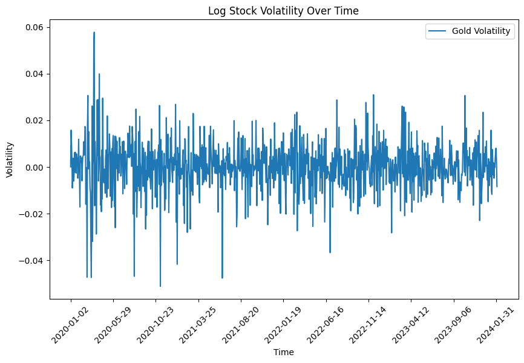

# Stock-Market-Prediction-using-Deep-Geometric-Brownian-Motion

This repository explores the application of **Deep Learning** combined with **Geometric Brownian Motion (GBM)** to model and predict stock prices. The project introduces an extension of GBM by incorporating an **alpha-stable noise term**, aiming to better capture rare, extreme events in stock price dynamics.

## Geometric Brownian Motion (GBM) for Stock Market Predictions

**Geometric Brownian Motion** is a stochastic process widely used in modeling stock prices and financial markets. The GBM model expresses stock prices as a continuous-time stochastic process, defined by the following differential equation:

$dS_t = \mu S_t dt + \sigma S_t dW_t$

where:
- $\( S_t \)$ is the stock price at time \( t \).
- $\( \mu \)$ represents the **drift**, or the expected return rate.
- $\( \sigma \)$ represents the **volatility** of the stock.
- $\( W_t \)$ is a **Wiener process** (or Brownian motion), responsible for introducing random fluctuations.

In this model, **future price changes** are influenced by both a deterministic drift $(\( \mu \))$ and a random noise component scaled by volatility $(\( \sigma \))$, making it a powerful tool for capturing **basic price dynamics** over time.  

This equation can be solved and the solutions is:  
$S_t = S_0 \exp\(\(\mu - \frac{\sigma ^ 2}{2} \)t + \sigma W_t\)$  

GBM is widely used in financial modeling because:
1. It assumes **log-normal distribution** of stock prices, aligning with the historical tendency of stock prices to be positive and skewed.
2. It captures the **random walk behavior** observed in stock prices, which often exhibit volatility and unpredictable fluctuations in the short term.

## Limitations of GBM in Accounting for Rare Events

While GBM effectively models standard market fluctuations, it falls short in representing **rare events** or **extreme price movements** (e.g., market crashes or sudden spikes). This limitation arises from the Wiener process, $\( W_t \)$, which assumes **normal (Gaussian) distribution** of returns.

- **Normal distribution** implies that extreme deviations are highly improbable. In practice, however, financial markets often experience events that are far more extreme than what a normal distribution would predict.
- **Thin tails** of the Gaussian distribution underrepresent the probability of rare events, making GBM less effective in capturing **high-risk, high-impact events** seen in real-world markets.

## Extending GBM with an Alpha-Stable Noise Term

To address the limitations of the Gaussian noise term, this project proposes an alternative noise model: **alpha-stable noise**.

### Why Alpha-Stable Distributions?

**Alpha-stable distributions** are a family of probability distributions characterized by their **heavy tails**, allowing them to model extreme events more effectively than Gaussian distributions. An alpha-stable distribution can capture a **higher likelihood of extreme deviations**, offering a more realistic representation of stock returns.

By replacing the Wiener process $\( W_t \)$ with an **alpha-stable noise term**, the stock price dynamics become:

$dS_t = \mu S_t dt + \sigma S_t dL_t^\alpha$

where:
- $\( L_t^\alpha \)$ is an **alpha-stable Lévy process** with stability parameter $\( \alpha \)$.
- **When $\( \alpha \leq 2 \)$**, the distribution captures **heavier tails** than a Gaussian, allowing for a higher frequency of extreme changes.

This modified model introduces **flexibility in the noise component** of the price dynamics, enabling it to better reflect **non-Gaussian behaviors** observed in markets, such as **fat tails** and **volatility clustering**. These features are essential for realistic stock market prediction, as they account for the **higher-than-expected probability of large price swings** that occur in real financial markets.

---
## Deep Learning Extension of Geometric Brownian Motion (GBM)

To enhance the flexibility of the **Geometric Brownian Motion model**, this project introduces a **neural network-based approach** to approximate stock price dynamics. Inspired by the analytical solution of the GBM, the stock price $\( S_t \)$ is given by:

$S_t = S_0 \exp \left( (\mu - \frac{\sigma^2}{2})t + \sigma W_t \right)$

In our approach, we modify this solution by incorporating a **neural network model**. Instead of directly calculating $\( S_t \)$ based on drift and volatility, we approximate it as follows:

$S_t = \exp \left( f(S_{t-1}) + \eta_t \right)$

where:
- $\( f(S_{t-1}) \)$ is a **neural network** function applied to the previous time step’s price, capturing **both linear and nonlinear interactions** in price evolution.
- $\( \eta_t \)$ represents an **alpha-stable noise term** that introduces heavy-tailed behavior, modeling rare events more effectively than Gaussian noise.

### Neural Network Structure for \( f(S_{t-1}) \)

The neural network function $\( f(S_{t-1}) \)$ combines:
1. A **nonlinear neural network** layer to capture **complex interactions and dependencies** in stock price behavior.
2. A **linear layer** to retain **linear dynamics** typical in financial time series.

This combined structure enables the model to capture both **traditional linear trends** and **nonlinear effects** present in financial data, improving its ability to model realistic price movements.

### Alpha-Stable Noise and Parameter Estimation

To account for rare events, we replace the standard Wiener process with an **alpha-stable noise term**, $\( \eta_t \)$, characterized by its **heavy-tailed** nature. An alpha-stable distribution has four parameters:
- **Stability $(\( \alpha \))$** and **skewness $(\( \beta \))$**: These are approximated directly as constants, based on the nature of the data.
- **Mean $(\( \mu_t \))$** and **scale $(\( \sigma_t \))$**: These are modeled as functions of the previous price $\( S_{t-1} \)$ using a **neural network** $\( g(S_{t-1}) \)$ such that:

$\mu_t, \sigma_t = g(S_{t-1})$

This setup allows the model to learn time-dependent adjustments to the mean and scale of the noise, adapting dynamically to market conditions.

### Summary

In this deep learning framework:
1. **Price dynamics** are approximated by combining nonlinear and linear interactions in the network function $\( f(S_{t-1}) \)$.
2. **Heavy-tailed noise** is introduced through an alpha-stable noise term $\( \eta_t \)$, allowing the model to account for rare events.

## Data

For this analysis, we used daily **Gold price data** spanning from early 2020 to early 2024. This dataset captures significant price movements over a 4-year period, reflecting market volatility influenced by global events and economic changes.

### Data Visualization

The plots below illustrate:
1. The **Gold price** trend over the selected timeframe, and
2. The **log returns of Gold price**, providing a clearer view of volatility in daily price changes.

## Training Methodology and Model

To predict the Gold price while accounting for market fluctuations and extreme events, we modeled **log returns** as a **Deep Geometric Brownian Motion** process with an **alpha-stable noise term**. The goal is to estimate parameters that align the model with the observed data while capturing the heavy-tailed behavior seen in financial returns.

### Variational Inference and the ELBO Loss

The model training is implemented in **Pyro**, leveraging **Stochastic Variational Inference (SVI)** to optimize the **Evidence Lower Bound (ELBO)**. The ELBO serves as the loss function, where:

1. **Reconstruction Term**: This measures the difference between the predicted price and the actual price $\( S_{t} \)$, based on the GBM-inspired equation.
2. **KL Divergence Term**: This term ensures the learned distribution aligns well with prior knowledge, helping the model fit the heavy-tailed data accurately.

### Training Process Visualization

To illustrate how the model adapts its predictions to the data, the **training procedure** is shown as a gif animation. The animation plotspredicted price over each epoch (red curve) with a 90% confidence interval (red shaded region), while the actual price is shown in gray. This visualization demonstrates how the model refines its predictions estimate and adapts to observed price movements over time.

## Results

After training, the model provides predictions for both the Gold price and its volatility. Below are the primary results and insights:

1. **Gold Price Fitted Curve**: The model’s predicted price (blue curve) aligns closely with the actual observed prices (gray curve), along with a **90% confidence interval** (shaded region), effectively capturing price fluctuations and rare price events.
2. **Stability Index**: The model’s stability parameter estimate for the alpha-stable noise term is:
   - **Stability index**: $\( \alpha = 1.931 \pm 0.0001252 \)$

The stability index, $\( \alpha \approx 1.931 \)$, indicates that the noise distribution is **heavy-tailed**, validating the model's ability to capture rare, extreme events which traditional GBM-based models struggle to account for.

### Final Visualization Summary

1. **Fitted Curve** with 90% CI:  
   

